# 🏛️ Дом Стульгінскага  
## Рэканструкцыя страчанага сэрца Добруша  
*аўтарскае даследаванне, v1.2*

---

### Уводзіны

У гісторыі кожнага горада ёсць асоба, без якой ён не быў бы тым, чым стаў.  
Для Добруша гэта **Антон Ігнатавіч Стульгінскі** — інжынер, кіраўнік, будаўнік і чалавек, які стварыў фабрыку, што стала сэрцам горада.  
Яго імя некалі гучала па ўсёй Расійскай імперыі, але сёння пра яго маўчаць нават у родным горадзе.  
Не засталося ні помніка, ні магілы, ні фатаграфіі яго дома — толькі ўспаміны, архіўныя радкі і народная памяць.  

Гэтае даследаванне — **спроба аднавіць месца і выгляд дома Антона Стульгінскага**, чалавека, які фактычна пабудаваў Добруш, і вярнуць яму месца ў гісторыі.

---

### 1. Асоба і эпоха

Антон Ігнатавіч Стульгінскі (1851–1915) паходзіў са старога шляхецкага роду Вялікага Княства Літоўскага.  
Яго продкі мелі зямельныя ўладанні на тэрыторыі сучаснай Літвы і Беларусі, служылі ў дзяржаўным апараце ВКЛ.  
Пасля падзелаў Рэчы Паспалітай і ўключэння гэтых зямель у склад Расійскай імперыі род Стульгінскіх апынуўся ў няласе —  
іх маёмасць была канфіскавана, а пасля **паўстання 1863 года** бацьку Антона, Ігната Іосіфавіча, пазбавілі пасады і падверглі рэпрэсіям.  

Антон атрымаў адукацыю інжынера-тэхнолага і быў прызначаны дырэктарам Добрушскай папяровай фабрыкі князя Паскевіча ў 1878 годзе.  
Паводле дамовы з уладальнікам, ён атрымліваў **10% ад чыстай прыбытку** фабрыкі — што было выключна высокай ацэнкай яго прафесіяналізму і адказнасці.

На працягу 37 гадоў Стульгінскі кіраваў прадпрыемствам і ператварыў яго ў **адно з самых перадавых у Расійскай імперыі**.  
Пры ім з’явілася:

- першая **электрастанцыя ў Беларусі** (1889)  
- адна з першых **цэнтральных тэлефонных станцый**  
- у 1894 годзе — **першы 8-гадзінны працоўны дзень у імперыі**  
- жыллё для спецыялістаў і рабочых, школа, шпіталь, аптэка  
- фабрычны пасёлак **Антонаўка**, названы яго імем  

Жыццё Стульгінскага скончылася ў 1915 годзе. Ён памёр ад стэнакардыі і быў пахаваны на гарадскіх могілках **Дубы** на беразе Іпуці.  
У 1917 годзе магіла была разбурана — вандалы шукалі золата. У 1920-я гады яе сляды зніклі зусім.

---

### 2. Страчаны дом у Добрушы

Усе крыніцы гавораць пра Стульгінскага як пра вялікага арганізатара, але ніводная не згадвае, **дзе ён жыў**.  
Фатаграфій не засталося, у архівах — цішыня.  
Толькі адзін след — **ўспаміны яго ўнучкі Зоф’і Грушэн (Стульгінскай)**, апублікаваныя ў кнізе *“The World May End”* (Нью-Ёрк, 1931).

> «Дом стаяў на беразе Іпуці, сярод вялікага парку.  
> Да яго вяла доўгая шкляная галерэя, якая злучала асноўную частку з зімовым садам, поўным пальм і кветак.  
> У “гасцявым крыле” было дзесяць пакояў, падзеленых шырокім калідорам з ваннай у канцы.  
> На Каляды ў галерэі ставілі вялікую ёлку, што даставала да столі.  
> З акон адкрываўся від на мост і фабрыку — дымныя трубы відаць былі праз сад.  
> Гэта быў сапраўдны дом-сэрца, дзе зліваліся праца і цеплыня.»

Гэтае апісанне стала адпраўным пунктам для пошуку.

---

### 3. Пошук і аналіз крыніц

Даследаванне пачалося з вывучэння літаратуры, газет і даведнікаў канца XIX — пачатку XX ст.  
Але **фотаздымкаў і дакладных апісанняў не знайшлося ні ў беларускіх, ні ў расійскіх, ні ў польскіх архівах**.

Затым было выяўлена, што ў 1960-я гады ў Мінску супрацоўніца Акадэміі навук збірала **“Архіў Стульгінскага”** — вялікую калекцыю дакументаў, лістоў і планаў фабрыкі.  
Яе даследаванне было спынена, бо ў савецкай інтэрпрэтацыі Стульгінскага трэба было паказваць “капіталістам-эксплуататарам”, а не героем працы.  
Архіў быў страчаны.

---

### 4. Зварот да аэрафотаздымкаў

Далейшы крок — звяртанне да **амерыканскага архіва NARA (National Archives and Records Administration)**.  
Праз мясцовага даследчыка **Майка Канстандзі** (<mconstandy@gmail.com>) былі атрыманыя **цыфраваныя аэрафотаздымкі Люфтвафэ** за 1943 год.

Папярэдне былі супастаўлены **палётныя заданні нямецкай авіяразведкі**, каб вызначыць серыі, дзе магчыма адлюстраваны Добруш.  
Пасля гэтага былі атрыманныя дакладныя кадры.  
На іх выразна бачны **рэшткі вялікага будынка** на месцы, дзе паводле старой гравюры павінна быў стаяць дом дырэктара фабрыкі.

---

### 5. Рэканструкцыя і вынік

Параўнанне трох крыніц —  
1. гравюры і паштоўкі “Добрушская писчебумажная фабрика князя Паскевича. 1882–1896”,  
2. кадраў Люфтвафэ 1943 года,  
3. і сучаснага спадарожнікавага здымку —  
паказала поўнае **супадзенне абрысаў** і арыентацыі будынка адносна ракі і фабрыкі.

Далей былі вызначаны контуры: галоўны корпус, зімовы сад, “гасцёвае крыло” з доўгай галерэяй — усё, што апісвала ўнучка Зоф’я.  
У выніку можна з упэўненасцю сказаць: **дом Стульгінскага быў лакалізаваны дакладна**.

---

### 6. Маёнтак Малое Дэмбна (Dębe Małe)

З успамінаў Зоф’і Грушэн вядома, што **пасля рэвалюцыі сям’я Стульгінскіх эвакуіравала ўсё сваё маёмасць** — мэблю, посуд, скульптуры, карціны — у маёнтак **Малое Дэмбна** (*Dębe Małe*), недалёка ад Варшавы.  

Гэта ўладанне Антон Стульгінскі **набыў яшчэ пры жыцці** — на сродкі, якія назапасіў як паспяховы дырэктар і партнёр князя Паскевіча.  
Згодна з дамовай, ён атрымліваў **10% ад прыбытку фабрыкі**, а грошы захоўваў у варшаўскім банку.  
Так ён забяспечыў сваю сям’ю і паказаў рысу, якая праходзіць праз усё яго жыццё —  
**дальнабачнасць, эканамічная культура і недавер да імперскай улады**, якая ўжо двойчы ўдарыла па яго родзе.

Для Стульгінскага Варшава была не чужой.  
Як нашчадак шляхты ВКЛ, ён адчуваў сябе часткай вялікага культурнага свету —  
дзе Беларусь, Літва і Польшча былі не межамі, а адзінай прасторай спадчыны і працы.  
І таму, калі згарэў яго дом у Добрушы, у Малым Дэмбне захавалася апошняе матэрыяльнае сведчанне яго жыцця —  
памяць пра чалавека, які **стварыў гарадскую цывілізацыю ў правінцыі і пакінуў след у трох краінах адначасова**.

---

### 7. Сучаснае становішча маёнтка

Маёнтак у Малым Дэмбне існуе і сёння.  
Яго дакладныя каардынаты: **52.01224427642441, 21.759204360049395**.  
Тэрыторыя акружана **высокім цагляным мурам і металічнымі варотамі**; доступ абмежаваны, паколькі аб’ект цяпер знаходзіцца ў **прыватнай уласнасці** (уласнік невядомы).

Паводле мясцовых крыніц і публікацый у польскіх рэгіянальных медыя,  
**некалькі гадоў таму ў доме адбыўся пажар**, у выніку якога частка інтэр’ераў і гістарычных рэчаў была пашкоджана агнём і вадой падчас тушэння.

Падчас асабістага наведвання ўдалося атрымаць фатаграфіі інтэр’ераў — частка мэблі, дзвярныя рамы і дэкор маглі паходзіць яшчэ з **дому Стульгінскага ў Добрушы**.  
Па іх стылі і матэрыяле яны супадаюць з тыповымі элементамі фабрыканцкіх сядзіб канца XIX стагоддзя.

---

### 8. Значэнне знаходкі

Гэта першы вядомы выпадак дакладнай лакалізацыі дома Стульгінскага.  
Дом не проста месца жыхарства — ён быў **функцыянальнай часткай фабрычнага комплексу**, дзе прымаліся дэлегацыі, жылі інжынеры, дзе ўпершыню загарэліся электрычныя лямпы ў Беларусі.  
Тут нарадзілася Антонаўка — рабочы пасёлак, які жыве і цяпер.

Знаходка ў Дэмбне адкрывае яшчэ адну старонку —  
яна злучае **Добруш, Варшаву і спадчыну Вялікага Княства Літоўскага** ў адну гісторыю чалавека, які будаваў, а не разбураў.

---

### Заключэнне

Дом Стульгінскага больш не існуе.  
Ён згарэў падчас Другой сусветнай вайны, а пасля быў канчаткова разбураны.  
Але дзякуючы ўспамінам, архіўным пошукам, аэраздымкам і даследаванню маёнтка ў Дэмбне  
удалося вярнуць **вобраз, маштаб і чалавечую гісторыю** таго, хто даў Добрушу яго сэрца.

Гэта даследаванне — не канец, а пачатак.  
Бо пакуль не вярнуліся імёны тых, хто будаваў нашы гарады,  
пакуль у цэнтры Добруша няма нават шыльды з імем Антона Стульгінскага — гісторыя застаецца няпоўнай.

---

## 📷 Ілюстрацыі

1. _croped.jpg)  
   *Панарама Добрушскай папяровай фабрыкі. Злева ўнізе — дом дырэктара.*

2. 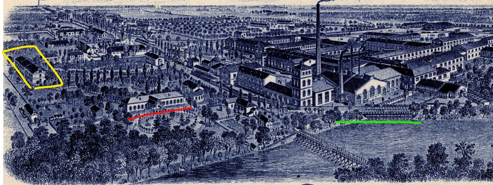  
   *Панарама з пазначэннем месца дома Стульгінскага.*

3. 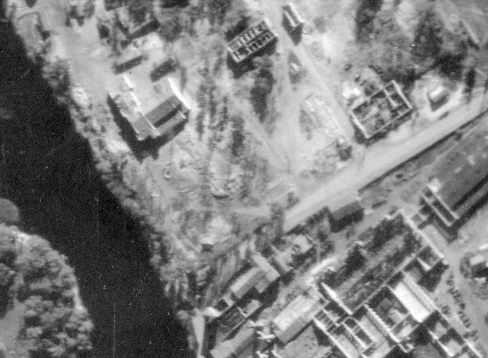  
   *Архіўны аэраздымак Добруша 1943 года.*

4. 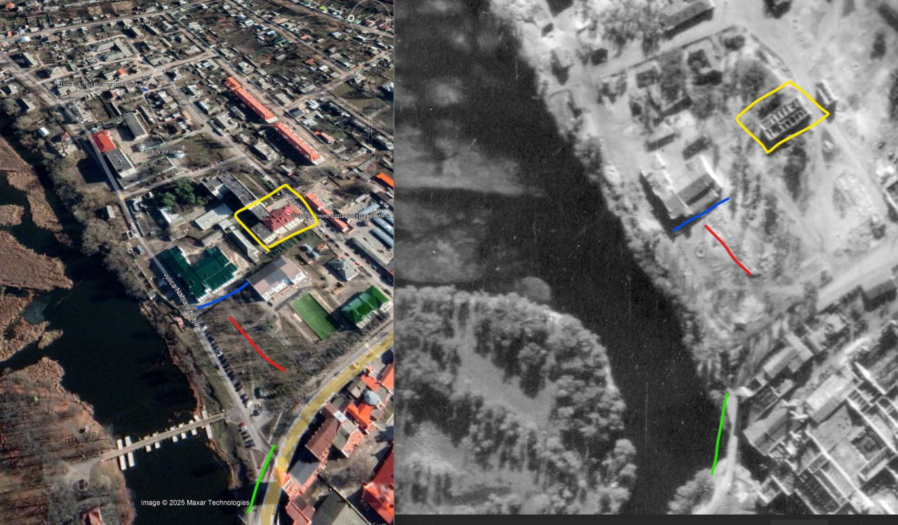  
   *Супастаўленне архіўнага аэраздымку і сучаснай карты. Геаметкі паказваюць рэшткі дома.*

5.   
   *Дом Стульгінскага "вяртаецца" на свой гістарычны ландшафт.*

6. 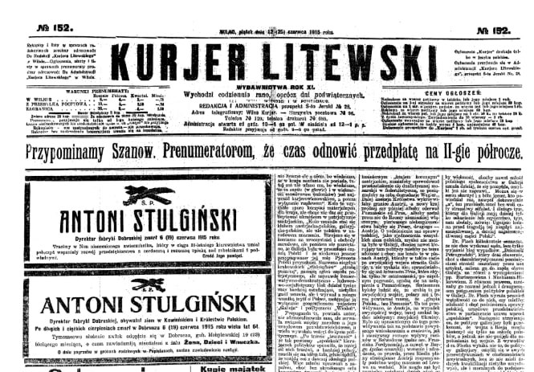  
   *Паведамленне пра смерць А. І. Стульгінскага ў газеце 1915 года.*

7. 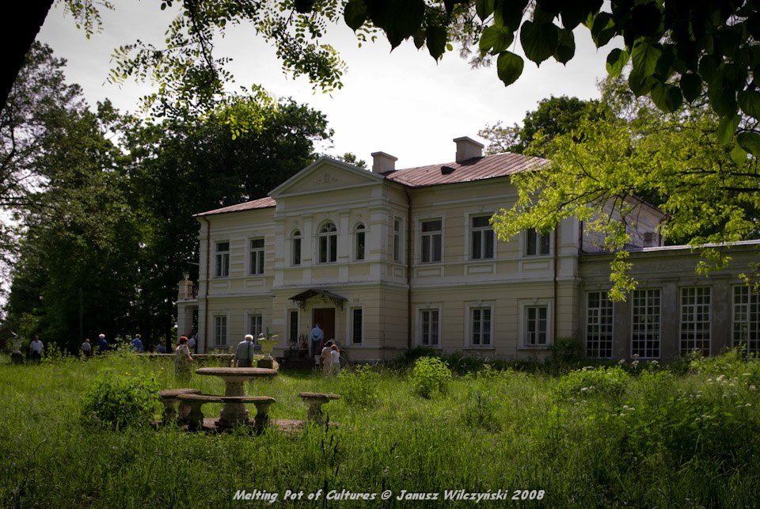  
   *Месца, куды пасля рэвалюцыі было эвакуіравана маёмасць сям'і Стульгінскіх.*

8.   
   *Фрагменты інтэр'ераў, магчыма, з дому Стульгінскага ў Добрушы.*

9. 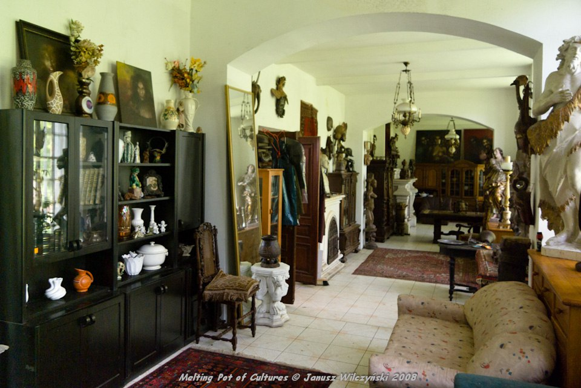  
   *Антыкварная мэбля ў маёнтку Dębe Małe.*

10. 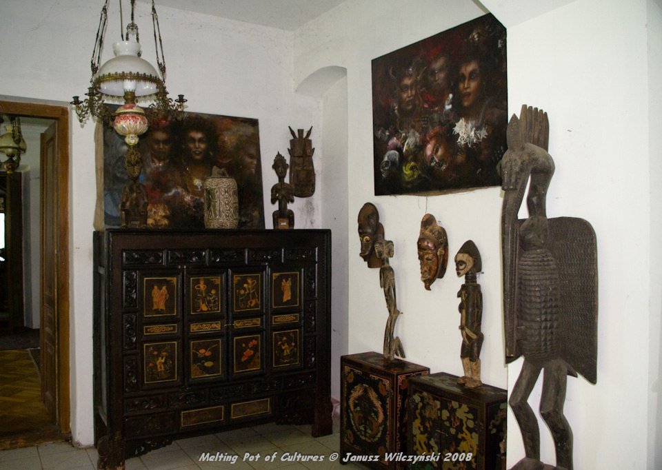  
    *Дадатковыя элементы інтэр'ера з маёнтка.*

11. 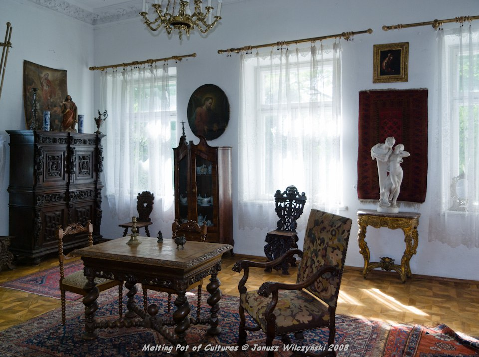  
    *Антыкварныя мэблевыя элементы, якія маглі паходзіць з дома Стульгінскага.*

12. 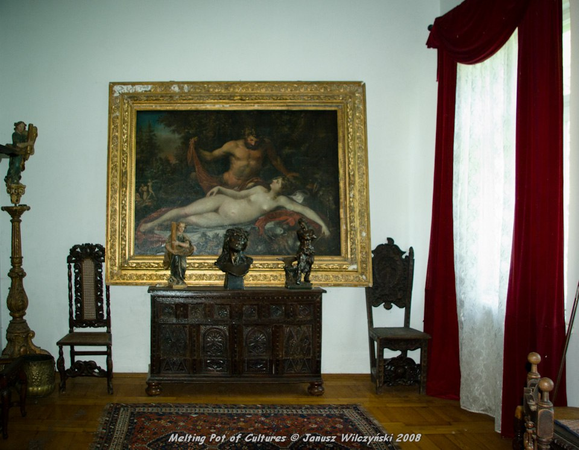  
    *Дэкаратыўныя элементы інтэр'ера маёнтка.*

13. 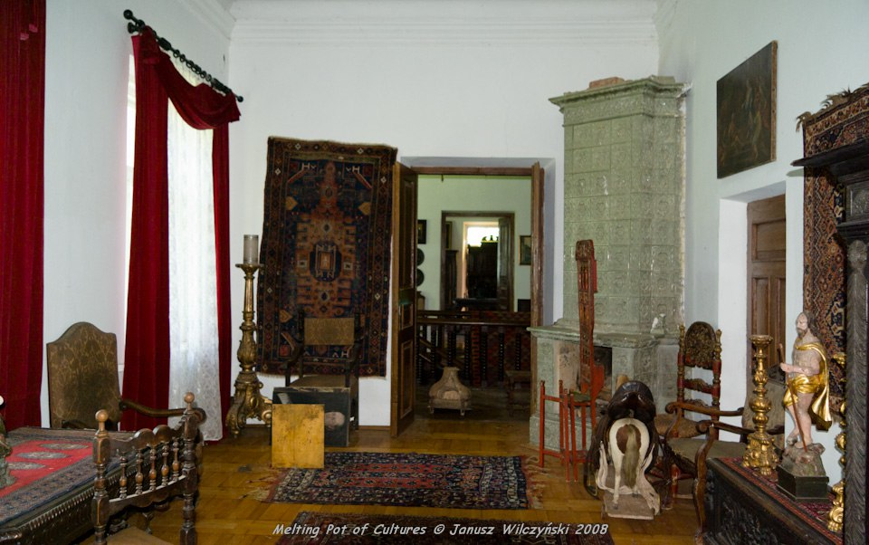  
    *Гістарычная мэбля з калекцыі маёнтка Dębe Małe.*

14. 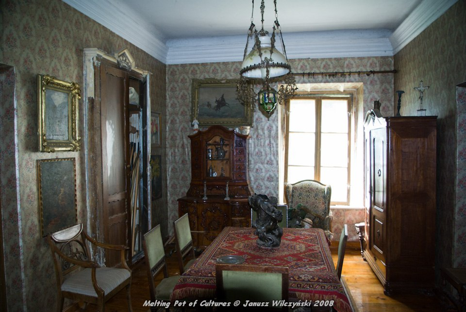  
    *Дадатковыя прадметы інтэр'ера канца XIX стагоддзя.*

15. 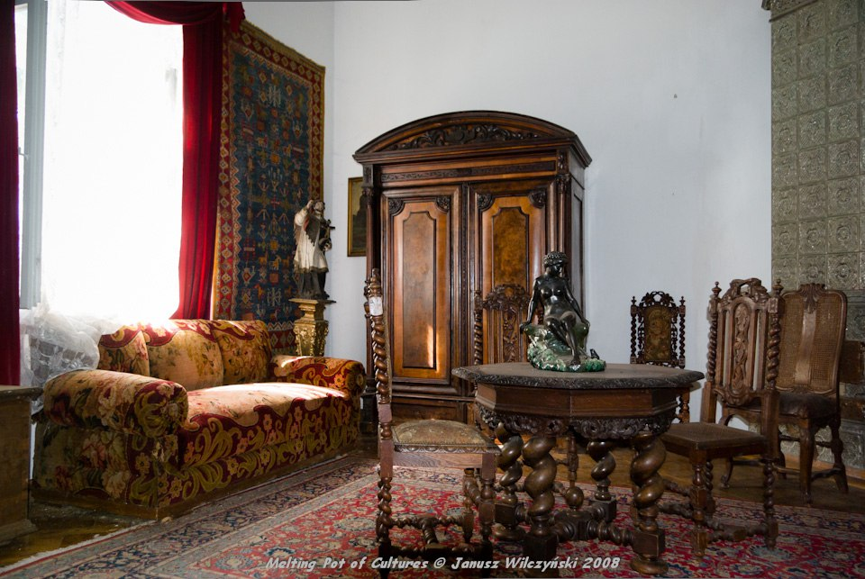  
    *Элементы ўнутранага ўпарадкавання маёнтка.*

16. 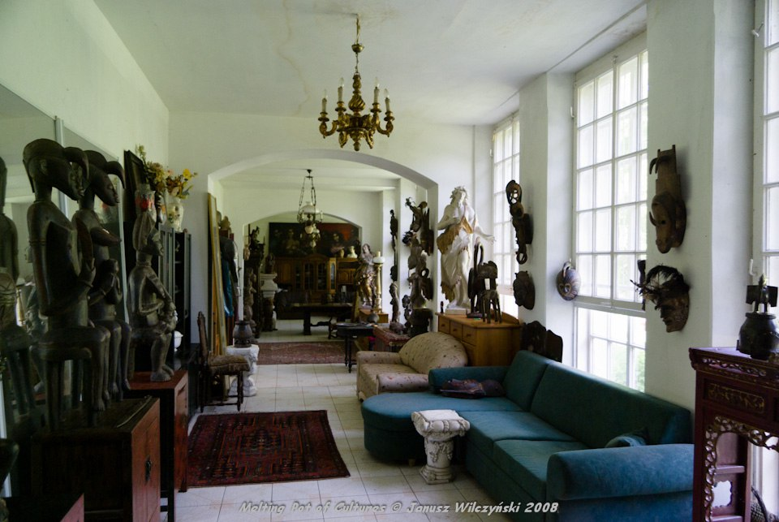  
    *Завяршальныя элементы калекцыі антыкварнай мэблі.*

17.   
    *Рэканструкцыя выгляду дома Стульгінскага на базе гістарычных крыніц.*

---

## 🕮 Крыніцы

1. *Kurjer Litewski*, №152, 1915 — паведамленне пра смерць А. І. Стульгінскага.  
2. Ірына Скарыетына (Ірына Келер), *“The World May End”*, New York, 1931.  
3. Архіў NARA (National Archives and Records Administration, USA) — Luftwaffe Aerial Reconnaissance Series 1943.  
4. Паштоўкі і матэрыялы з прыватных збораў (Дабруш, Варшава, Вільня).  
5. Даследаванне “Архіў Стульгінскага”, АН БССР, 1960-я гг. (утрачана).  
6. Польскія лакальныя медыя: паведамленні пра пажар у Dębe Małe, 2010–2020 гг.  
7. Аўтарскае даследаванне і палявыя даследаванні (Добруш, Dębe Małe), 2024–2025 гг.

---

© Варшава, 2025, даследаванне і тэкст — Павел Новікаў
Ліцэнзія: Creative Commons Attribution 4.0 (CC BY 4.0)
